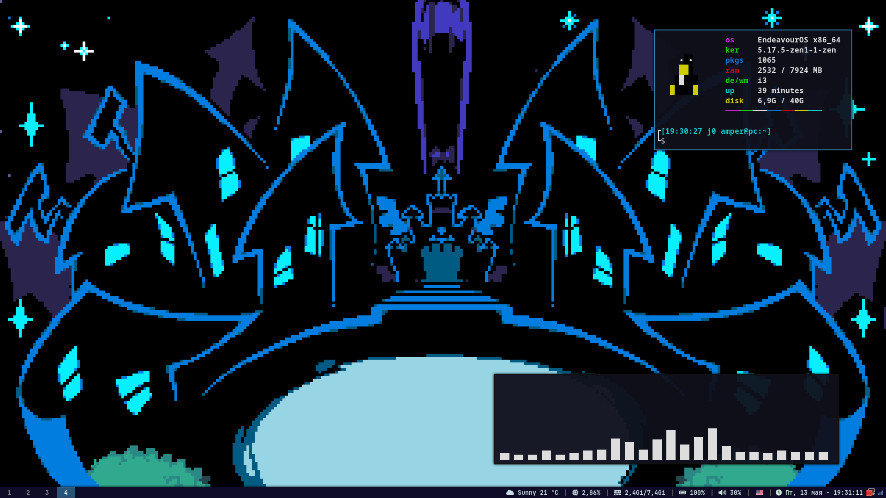
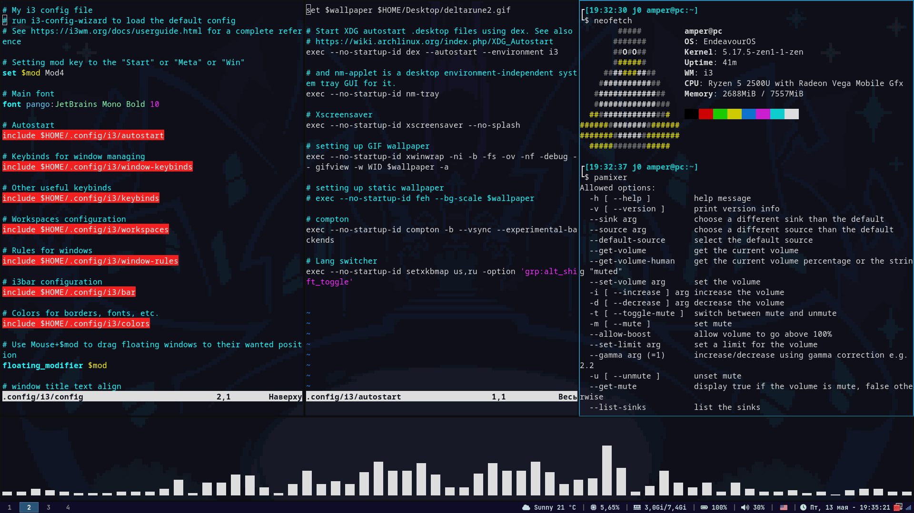

# My i3 config file
Sample screenshots:



## Used Utilities
* `i3-gaps`
* `i3blocks`
* `dex`
* `nm-tray`
* `xscreensaver`
* `xwinwrap` and `gifsicle` for GIF wallpaper
* `feh` for static wallpaper
* `picom`
* `pactl`
* `light`
* `flameshot`
* `polkit`
#### Other:
* `ttf-font-awesome`
* [JetBrains](https://www.jetbrains.com/lp/mono/) Mono Bold font
* [Papirus](https://github.com/PapirusDevelopmentTeam/papirus-icon-theme) icon theme

## Installation
```
$ git clone amper-i3-config
$ cd amper-i3-config
$ sudo chmod +x ./install.sh
$ ./install.sh
```
## Tips
* Edit `$wallpaper` var in the `./configs/autostart` file to change wallpaper
